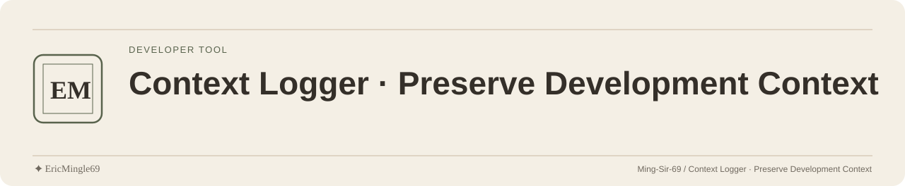

<picture>
  <source media="(prefers-color-scheme: dark)" srcset="readme-assets/header-dark.svg">
  <source media="(prefers-color-scheme: light)" srcset="readme-assets/header-light.svg">
  
</picture>

<p align="center">
  <a href="README.md">简体中文</a> · <a href="README.en.md">English</a> · <a href="PERSONAL-NOTICE.md">✦ EricMingle69</a>
</p>

# Context Logger · 保存开发上下文

把一个明确的 Codex 或 Claude Code Session 保存为可核验的本地上下文。
无需摘要模型或向量数据库；Raw 是事实源，Markdown 与 SQLite 索引可重建。

## 先解析，再保存

从仓库根目录使用命令入口，替换下列占位符：

```sh
python3 scripts/transcript_manager.py resolve \
  --source codex \
  --session-id <current-thread-id> \
  --project-root /absolute/path/to/workspace \
  --module-id <registered-module-id>
```

Claude Code 使用 `--source claude-code` 和明确的 Session ID；也可按 [SKILL.md](SKILL.md)使用 SessionStart 锚点。
核对来源、Session 和归档目标后，用相同解析参数执行 `save`。
再以已解析的归档目录运行 `verify --target-dir /absolute/path/to/archive --session-id <session-id>`；占位路径与 ID 必须替换。
只有 `verify` 返回 `verified=true` 才说明数据层一致。

## 四层数据

| 层 | 用途 |
| --- | --- |
| Raw JSONL | 原始字节及重建依据 |
| Normalized 事件 | 跨宿主统一事件 |
| Markdown Chunk / Index | 正文阅读与定位 |
| SQLite FTS5 | 可删除、可重建的全文索引 |

用户与 AI 正文在 Markdown 分片中完整保留。
工具输入和结果的 Markdown 展示最多 2,000 字符，结果索引最多 8,000 字符；完整内容仍有 Raw 引用。

## Claude Hook 安装

```sh
bash install.sh
```

该入口保留式登记 SessionStart，写入真实 `~/.claude/settings.json` 与 Hook 文件。
`install.sh` 不转发参数；临时目标或恢复必须直接使用 [Python 安装器](scripts/install_claude_hook.py)。
既有 `hooks` 缺失或为 `null` 时会停止，需提供可信基线，而非假定配置为空。

## 检索与恢复

先读模块 `INDEX.md`，再用 `search` 找候选、`show` 读相关 Chunk，避免全量加载 Transcript。
`rebuild-index` 从 Raw 与 Manifest 重建派生层；派生失败时 Raw 保留，状态标记 `needs_rebuild`。
受管工作区的策略要求目标命中已登记模块，不自动在根目录创建 Transcript。

## 来源与许可

支持范围见 [SKILL.md 的来源边界](SKILL.md#来源边界)，普通 ChatGPT 聊天不在当前范围。
会话正文、Raw 与凭据应留在本机授权范围内，反馈使用脱敏样例。
[MIT License](LICENSE)：Copyright (c) 2026 Eric Mingle (Ming-Sir-69)。

---

文档维护：**✦ EricMingle69** · [Ming-Sir-69](https://github.com/Ming-Sir-69)  
[个人标识、许可与权限说明](PERSONAL-NOTICE.md) · 明暗页眉随 GitHub 主题自动切换。
